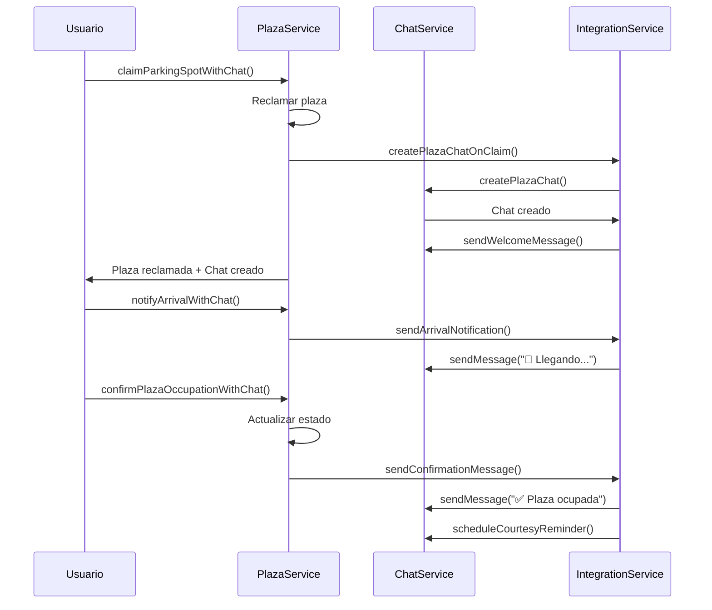

# 📱 Guía de Integración: Plaza + Chat

Esta guía explica cómo utilizar la integración entre el sistema de plazas y el chat en la aplicación Apparcar.

## 🏗️ **Arquitectura**

```
Core Services/
├── PlazaService                     ✅ Servicio principal de plazas
├── ChatService                      ✅ Servicio principal de chat  
└── PlazaChatIntegrationService      ✅ Servicio de integración

Features/
├── plaza/
│   ├── components/
│   │   └── plaza-usage-example.ts   📄 Ejemplo de uso
│   └── services/
│       └── plaza-service-example-integration.ts 📄 Ejemplo de servicio
```

## 🔧 **Funcionalidades Integradas**

### 1. **Reclamar Plaza con Chat Automático**
```typescript
// En cualquier componente
constructor(private plazaService: PlazaService) {}

async claimPlaza(plazaId: string, currentUser: User) {
  const result = await this.plazaService.claimParkingSpotWithChat(plazaId, currentUser);
  // ✅ Plaza reclamada
  // ✅ Chat creado automáticamente
  // ✅ Mensaje de bienvenida enviado
}
```

### 2. **Navegación al Chat de Plaza**
```typescript
openPlazaChat(plazaId: string) {
  this.plazaService.openPlazaChat(plazaId);
  // ✅ Navega a /chat/plaza-{plazaId}
}
```

### 3. **Notificaciones de Llegada**
```typescript
notifyArrival(plazaId: string, estimatedMinutes: number) {
  this.plazaService.notifyArrivalWithChat(plazaId, estimatedMinutes);
  // ✅ Envía mensaje: "🚗 El usuario está llegando (ETA: X minutos)"
}
```

### 4. **Confirmación de Ocupación**
```typescript
confirmOccupation(plazaId: string, successful: boolean) {
  this.plazaService.confirmPlazaOccupationWithChat(plazaId, successful);
  // ✅ Actualiza estado de plaza
  // ✅ Envía mensaje de confirmación al chat
  // ✅ Programa recordatorio de cortesía
}
```

### 5. **Reportar Problemas con Chat de Emergencia**
```typescript
async reportIssue(plazaId: string, description: string, user: User) {
  const emergencyChat = await this.plazaService.reportPlazaIssueWithChat(plazaId, user, description);
  // ✅ Crea chat de emergencia
  // ✅ Conecta con soporte
  // ✅ Envía detalles del problema
}
```

## 📋 **Flujo Completo de Uso**



## 🎯 **Casos de Uso**

### **Caso 1: Plaza Reclamada Exitosamente**
1. Usuario reclama plaza → `claimParkingSpotWithChat()`
2. Se crea chat automático entre dueño y reclamante
3. Usuario notifica llegada → `notifyArrivalWithChat()`
4. Usuario confirma ocupación → `confirmPlazaOccupationWithChat(true)`
5. Se envía recordatorio de cortesía después de 30s

### **Caso 2: Problema con la Plaza**
1. Usuario encuentra problema → `reportPlazaIssueWithChat()`
2. Se crea chat de emergencia con soporte
3. Agente atiende el problema
4. Se resuelve o se ofrece alternativa

### **Caso 3: Plaza No Disponible**
1. Usuario llega y plaza no está → `confirmPlazaOccupationWithChat(false)`
2. Se marca plaza como no disponible
3. Se ofrece ayuda para encontrar alternativa

## 🔍 **Verificación de Estado**

```typescript
// Verificar si existe chat activo
hasChat$ = this.plazaService.hasActivePlazaChat('plaza-123');

hasChat$.subscribe(hasChat => {
  this.showChatButton = hasChat;
});
```

## 📱 **Ejemplo de Componente Completo**

Ver archivo: `src/app/features/plaza/components/plaza-usage-example.ts`

## ⚙️ **Configuración Adicional**

### **Variables de Entorno**
```typescript
// environment.ts
export const environment = {
  chatIntegration: {
    enabled: true,
    autoCreateChat: true,
    emergencySupport: true
  }
};
```

### **Personalización de Mensajes**
Los mensajes del sistema se pueden personalizar editando:
`src/app/core/services/plaza-chat-integration.service.ts`

## 🚀 **Próximas Funcionalidades**

- [ ] Chat grupal para plazas compartidas
- [ ] Valoraciones automáticas post-intercambio
- [ ] Integración con notificaciones push
- [ ] Historial de intercambios por usuario
- [ ] Chat bot para preguntas frecuentes

---

**Documentación actualizada:** Enero 2025  
**Versión:** 1.0.0
